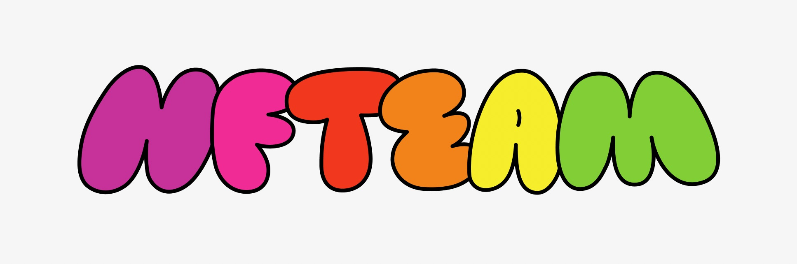

# MBTI "NF" team

  
  
  

  

<table align="center" width="100%">
  <tr>
    <td align="center">
INFP
<a href="https://github.com/ejolie"> 
<b>Marron</b>
</a><small>👩🏻‍💻 Back-End Developer</small></td>
    <td align="center">
INFJ
<a href="https://github.com/saseungmin"> 
<b>Harang</b>
</a><small>⚛️ Front-End Developer</small></td>
    <td align="center">
ENFP
<a href="https://github.com/jooseyoung"> 
<b>Jenny</b>
</a><small>🨠Product Designer</small></td>
  </tr>
</table>
